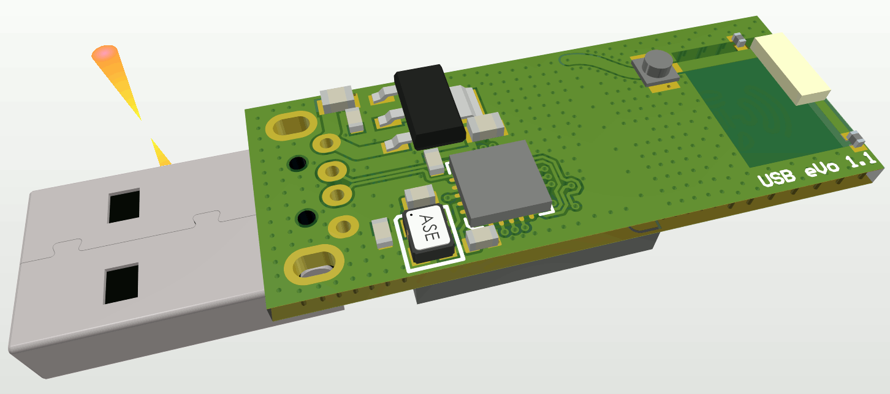
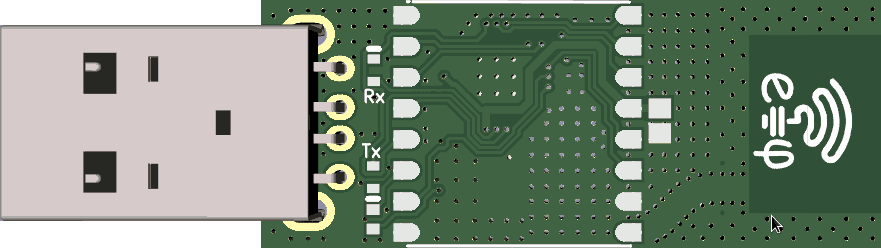
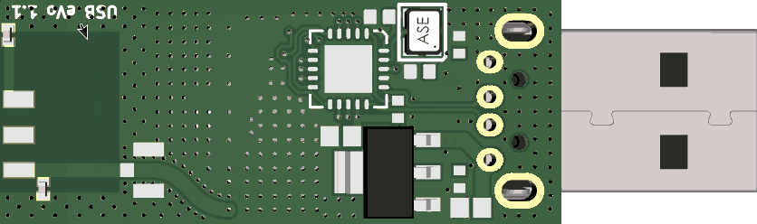
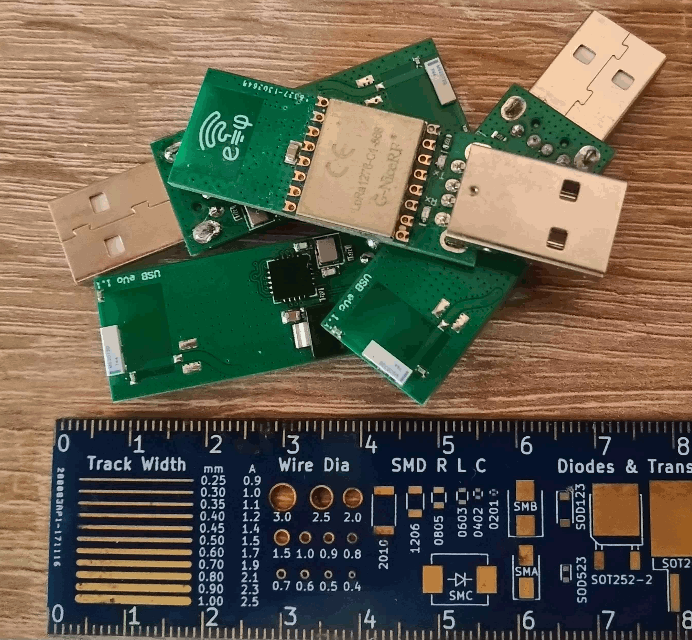

# usb-evp
**USB Event Packet** protocol (LoRA) Stick

## Description

USB stick for **Event Packet** (LoRa) with integrated antenna on ISM 868/915 bands.

Exposes a generic USB HID interface by MCP2210, enabling OS & driver agnostic access from userland.

## Specs:

* **Smallest LoRa stick** on the market by 1.6 x 4 cm
* Uses FCC and CE **certified** 100mW NiceRF module
* Own **ceramic micro-antenna** (VNA proved RF) for ISM band
* **OS agnostic**, opensource USB stack for windows, linux, android etc
* **C / C++ / Python** frontend with various examples and optional fast [SPECK](https://en.wikipedia.org/wiki/Speck_(cipher)) crypto stack
* May support **LPWAN networking** (IPv6 over 802.15.4 mac layer), with third party kernel module

Can be used in any USB port realying packets over the air.

## Project files
* See the [design files](hardware) available for Altium ®, CircuitMaker ®, KiCAD and Gerber format.
* Check [schematic](hardware/USB-eVo_v1.1.pdf) available as quick readable format.
* There is also an CircuitMaker ® [online version](https://circuitmaker.com/Projects/Details/Cristian-Balint/USB-LoRa) available.
* Software tools for managing the stick and examples coming soon (WiP).

## Board images

